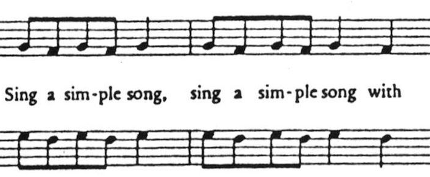
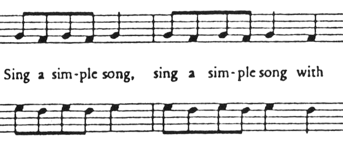
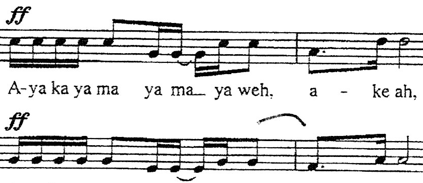
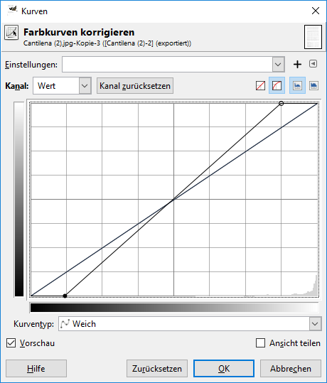

## Improve Input
{: .no_toc }

Sometimes the base image is of rather bad quality.
Although the human's eye can identify the notes correctly, the algorithms have problems to detect
the components of a score correctly.

Here are some possible improvements using Gimp.
## Table of contents
{: .no_toc .text-delta }

1. TOC
{:toc}

---

### Adjust Brightness and Contrast

The simplest way is to adjust the brightness of an input image.
Although Audiveris has a very good automatic binarization algorithm, sometimes manual adjustment
improves the recognition.

Have a look a the following part of a score: there are a lot of disturbances between the staff lines.

Now simply increase the brightness of the image by using the color curve tool.
Keep the dark parts black, to get an image like this:

### Improve Image using Filters

Have a look at the following image: here we have a lot of noise in the lines and in the bars.
The transcriptions will have problem to properly detect the bars in such a case.

Now use a gaussian blur filter with size 1.5 to 2.0, and you get the following:

Now use the color curve tool an remove about the top and bottom 10% of the input brightness range
(look at the result, the optimal values depend on your input image):

and you get something like this (the stems should still be a close line):

Finally use an "unsharp mask" filter with standard deviation set to about 1.0 to regenerate a sharp image:

You see that now the noise is almost completely removed.
